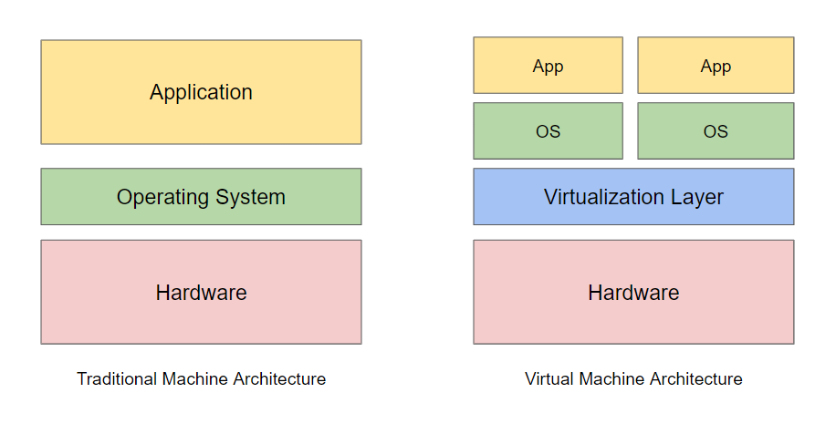

# **What is Cloud Computing?**
---

- **Definition**: Cloud computing is the delivery of computing services—such as servers, storage, databases, networking, software, and more—over the internet (“the cloud”).
- **Key Characteristics**:
  - **On-demand access**: Resources are available whenever needed.
  - **Scalability**: Services can scale up or down based on demand.
  - **Remote Access**: Resources are accessible from anywhere with an internet connection.

* * *

# **Cloud Service Models**
---

- **Objective**: Understand the three primary service models in cloud computing.
- **Models Covered**: 
  - **IaaS** (Infrastructure as a Service)
  - **PaaS** (Platform as a Service)
  - **SaaS** (Software as a Service)

* * *

# **IaaS - Infrastructure as a Service**
---

- **Definition**: IaaS provides virtualized computing resources over the internet.
- **Features**:
  - Access to servers, storage, and networks.
  - High control over the infrastructure.

* * *

# **PaaS - Platform as a Service**
---

- **Definition**: PaaS provides a framework for developers to build, test, and deploy applications.
- **Features**:
  - Simplifies app development with built-in infrastructure management.
  - Offers tools for collaborative development and testing.

* * *

# **SaaS - Software as a Service**
---

- **Definition**: SaaS delivers software applications over the internet on a subscription basis.
- **Features**:
  - Accessible from any device with internet.
  - Reduces need for software installation and maintenance.

---

---

* * *

# **Cloud Deployment Models**
---

- **Objective**: Understand the deployment options in cloud computing.
- **Models Covered**: 
  - **Public Cloud**
  - **Private Cloud**
  - **Hybrid Cloud**

* * *

# **Private Cloud**
---

- **Definition**: Exclusive infrastructure dedicated to a single organization.
- **Features**:
  - Greater control over security and compliance.
  - Often hosted on-premises or with a private provider.
- **Examples**: IBM Cloud Private, VMware Private Cloud.

* * *

# **Public Cloud**
---

- **Definition**: Services are delivered over the internet and shared among multiple customers.
- **Features**:
  - Cost-effective with scalable resources.
  - Managed by third-party providers.
- **Examples**: Amazon Web Services (AWS), Google Cloud, Microsoft Azure.

* * *

# **Hybrid Cloud**
---

- **Definition**: A combination of public and private cloud resources.
- **Features**:
  - Flexibility to run workloads across different environments.
  - Balances cost efficiency and control.
- **Examples**: AWS Outposts, Azure Arc.

* * *

# **Content Delivery Network (CDN)**
---

- **Definition**: A network of servers that deliver content based on user location.
- **Benefits**:
  - Reduces latency by caching data closer to the user.
  - Enhances content delivery speed and reliability.
- **Examples**: AWS CloudFront, Azure CDN, Cloudflare.
- **Use Case**: Ideal for websites with global user bases or media-heavy applications.

---

---

* * *

# **Data Centers and Virtualization**
---

- **Data Centers**:
  - Physical facilities that host cloud infrastructure.
  - Use redundancy and failover mechanisms for reliability.
- **Virtualization**:
  - Abstracts physical resources into virtual machines (VMs).
  - Enables efficient resource allocation and scalability.

---

---

* * *

# **Virtual Machines (VMs)**
---

- **Definition**: Software emulations of physical computers, running on a host machine.
- **Features**:
  - Isolated operating system instances.
  - Full control over configuration and resource allocation.
- **Use Case**: Ideal for running traditional applications and full-stack environments.

* * *

# **Containers**
---

- **Definition**: Lightweight, standalone packages of code and dependencies.
- **Benefits**:
  - More efficient and portable than VMs.
  - Consistent environment across different platforms.
- **Tools**: Docker (for creating containers).
- **Use Case**: Cloud-native applications requiring high portability.

* * *

# **Container Orchestration with Kubernetes**
---

- **Definition**: Kubernetes automates the deployment, scaling, and management of containers.
- **Features**:
  - Manages containerized applications across multiple hosts.
  - Enables easy scaling, load balancing, and updates.
- **Use Case**: Microservices-based applications and scalable deployments.

* * *

# **Types of Cloud Storage**
---

- **Object Storage**: Stores data as objects (e.g., AWS S3).
  - **Best for**: Media files, backups, big data analytics.
- **File Storage**: Organizes data as files and folders (e.g., Amazon EFS).
  - **Best for**: Shared storage, legacy applications.
- **Block Storage**: Low-latency storage for VMs (e.g., Amazon EBS).
  - **Best for**: Databases, transactional applications.

* * *

# **Cloud Storage Cost Considerations**
---

- **Cost Factors**:
  - **Data Storage**: Cost based on the amount of data stored.
  - **Data Transfer**: Charges for data moved between regions.
  - **Access Frequency**: Different costs for hot (frequent access) vs. cold (rare access) storage.

* * *

# **SQL vs. NoSQL Databases**
---

- **SQL Databases**: Structured data, uses SQL (e.g., Amazon RDS, Azure SQL).
  - **Best for**: Relational data, complex queries, financial data.
- **NoSQL Databases**: Unstructured or semi-structured data (e.g., MongoDB, DynamoDB).
  - **Best for**: Real-time data, IoT, and dynamic schema requirements.

* * *

# **Managed Database Services**
---

- **Definition**: Fully managed databases handled by cloud providers.
- **Benefits**:
  - Automatic backups, scaling, and maintenance.
  - Security and compliance features.
- **Examples**: Amazon RDS, Google Firestore, Azure Cosmos DB.

* * *

# **Virtual Machines in the Cloud**
---

- **Cloud VMs**: AWS EC2, Azure VMs, GCP Compute Engine.
- **Configuration Options**: CPU, RAM, storage, network configurations.

* * *

# **Autoscaling and Load Balancing**
---

- **Autoscaling**: Automatically adjusts resources based on demand.
- **Load Balancing**: Distributes traffic across multiple instances.
- **Benefits**: Ensures reliability, optimizes cost.

* * *

# **Virtual Private Cloud (VPC)**
---

- **Definition**: Isolated virtual network in the cloud.
- **Components**: Subnets, IP ranges, gateways.

* * *

# **Security Essentials**
---

- **Firewalls**: Control inbound and outbound traffic.
- **Security Groups**: Define access permissions for instances.
- **Best Practices**: Regular audits, use of encryption.

* * *

# **Data Security**
---

- **Encryption**: At rest and in transit.
- **Identity Access Management (IAM)**: Control access based on roles and permissions.

* * *

# **Compliance Standards**
---

- **GDPR**: Data privacy regulations in the EU.
- **HIPAA**: Healthcare data regulations in the U.S.

* * *

# **CI/CD in the Cloud**
---

- **CI/CD Pipelines**: Automates testing and deployment.
- **Benefits**: Faster releases, fewer errors.
- **Examples**: AWS CodePipeline, GitHub Actions.

* * *

# **Infrastructure as Code (IaC)**
---

- **Definition**: Managing infrastructure using code.
- **Tools**: Terraform, AWS CloudFormation.
- **Benefits**: Consistency, ease of scaling, reproducibility.

